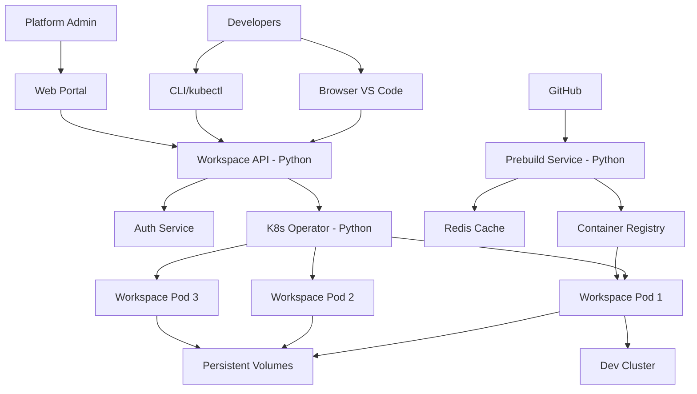
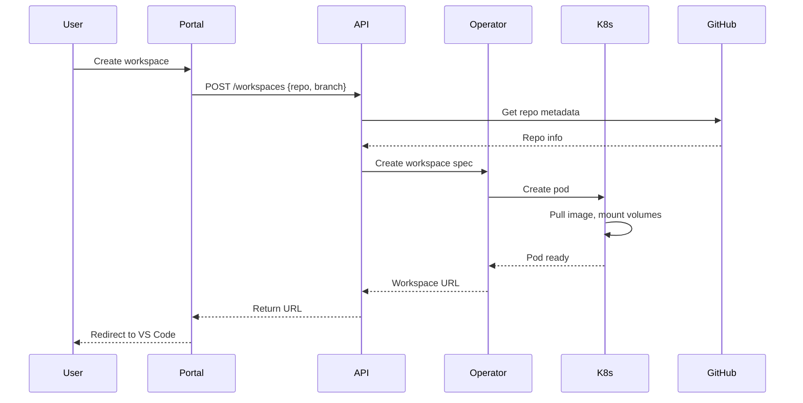
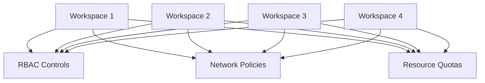
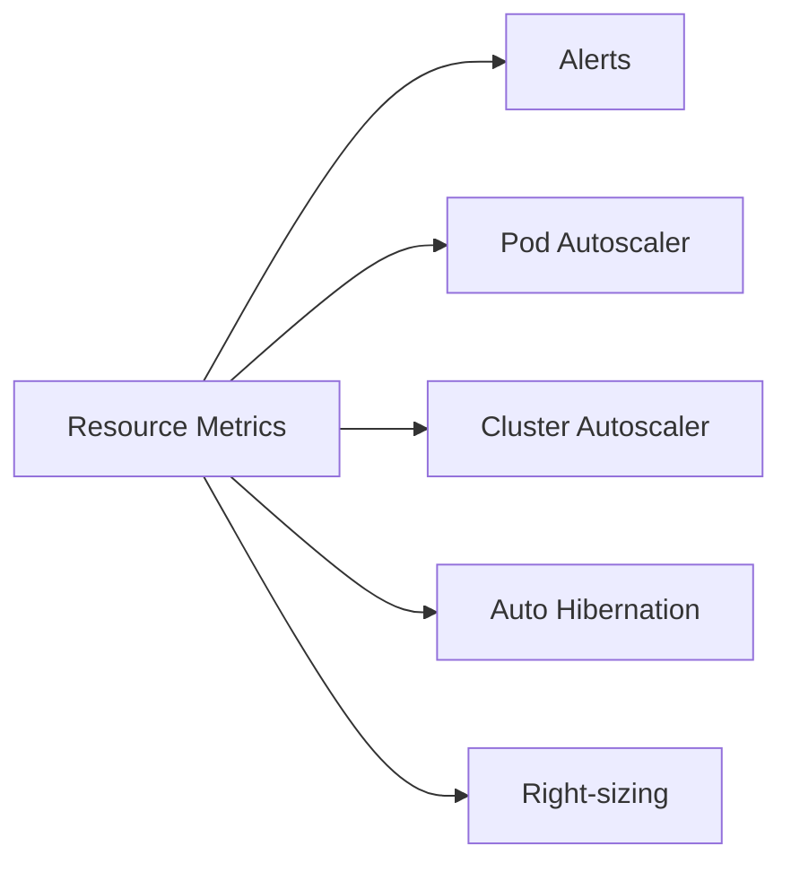

# Architecture Diagrams

## System Overview

```mermaid
graph TB
    DEV[Developers] --> BROWSER[Browser VS Code]
    DEV --> CLI[CLI/kubectl]
    ADMIN[Platform Admin] --> PORTAL[Web Portal]
    
    BROWSER --> API[Workspace API - Python]
    CLI --> API
    PORTAL --> API
    
    API --> AUTH[Auth Service]
    API --> OPERATOR[K8s Operator - Python]
    
    OPERATOR --> POD1[Workspace Pod 1]
    OPERATOR --> POD2[Workspace Pod 2]
    OPERATOR --> POD3[Workspace Pod 3]
    
    POD1 --> PV[Persistent Volumes]
    POD2 --> PV
    POD3 --> PV
    
    PREBUILD[Prebuild Service - Python] --> CACHE[Redis Cache]
    PREBUILD --> REGISTRY[Container Registry]
    
    GITHUB[GitHub] --> PREBUILD
    REGISTRY --> POD1
    POD1 --> K8SDEV[Dev Cluster]
```

## Workspace Creation Flow

```mermaid
sequenceDiagram
    participant User
    participant Portal
    participant API
    participant Operator
    participant K8s
    participant GitHub

    User->>Portal: Create workspace
    Portal->>API: POST /workspaces {repo, branch}
    API->>GitHub: Get repo metadata
    GitHub-->>API: Repo info
    API->>Operator: Create workspace spec
    Operator->>K8s: Create pod
    K8s->>K8s: Pull image, mount volumes
    K8s-->>Operator: Pod ready
    Operator-->>API: Workspace URL
    API-->>Portal: Return URL
    Portal-->>User: Redirect to VS Code
```

## Security Model

```mermaid
graph TB
    WS1[Workspace 1] --> RBAC[RBAC Controls]
    WS2[Workspace 2] --> RBAC
    WS3[Workspace 3] --> RBAC
    WS4[Workspace 4] --> RBAC
    
    WS1 --> NETPOL[Network Policies]
    WS2 --> NETPOL
    WS3 --> NETPOL
    WS4 --> NETPOL
    
    WS1 --> QUOTA[Resource Quotas]
    WS2 --> QUOTA
    WS3 --> QUOTA
    WS4 --> QUOTA
```

## Resource Management

```mermaid
graph LR
    METRICS[Resource Metrics] --> ALERTS[Alerts]
    METRICS --> HPA[Pod Autoscaler]
    METRICS --> CA[Cluster Autoscaler]
    METRICS --> HIBERNATION[Auto Hibernation]
    METRICS --> RIGHTSIZING[Right-sizing]
```
